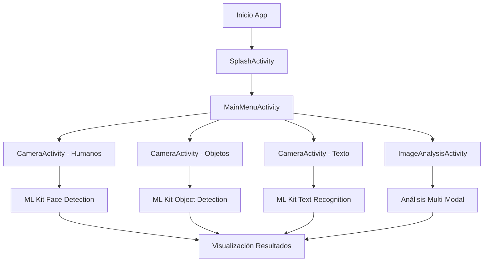

# 📱 AppRastreador

<div align="center">


**Aplicación Android de detección y análisis de objetos en tiempo real usando Machine Learning**

[Características](#-características) • [Tecnologías](#-tecnologías) • [Instalación](#-instalación) • [Uso](#-uso) • [Documentación](#-documentación)

</div>

---

## 📖 Descripción

**AppRastreador** es una aplicación Android avanzada que utiliza tecnologías de Machine Learning y visión por computadora para detectar y analizar objetos, reconocer texto e identificar caras humanas en tiempo real. La aplicación procesa imágenes desde la cámara del dispositivo o desde la galería, proporcionando resultados instantáneos con visualizaciones interactivas.

### 🎯 Características Principales

- ✅ **Detección de Objetos en Tiempo Real**: Identifica múltiples objetos simultáneamente
- ✅ **Reconocimiento de Texto (OCR)**: Extrae texto de imágenes en tiempo real
- ✅ **Detección Facial Avanzada**: Detecta caras con información de edad, género y expresiones
- ✅ **Análisis de Imágenes Estáticas**: Analiza fotos desde cámara o galería
- ✅ **Interfaz Intuitiva**: Diseño moderno y fácil de usar
- ✅ **Procesamiento Local**: Todo el ML se ejecuta en el dispositivo (sin internet)

---

## ✨ Características

### 🔍 Modos de Detección

| Modo | Descripción | Tecnología |
|------|-------------|------------|
| 🧑 **Detección de Humanos** | Detecta caras con información detallada (edad, género, expresiones) | ML Kit Face Detection |
| 📦 **Detección de Objetos** | Identifica múltiples objetos con clasificación y probabilidad | ML Kit Object Detection |
| 📝 **Reconocimiento de Texto** | Extrae texto de imágenes con OCR en tiempo real | ML Kit Text Recognition |
| 🖼️ **Análisis de Imagen** | Analiza imágenes estáticas desde cámara o galería | ML Kit Multi-Modal |

### 🎨 Interfaz de Usuario

- **Pantalla de Inicio Animada**: Splash screen con animación de carga
- **Menú Principal Intuitivo**: Navegación clara con botones grandes
- **Vista de Cámara en Tiempo Real**: Preview con overlay de detecciones
- **Visualización Interactiva**: Bounding boxes y etiquetas en tiempo real
- **Controles Fáciles**: Botones de ayuda, cambio de cámara y navegación

---

## 🛠️ Tecnologías

### Core Framework
- **Android SDK** - Framework principal de desarrollo
- **Java 11** - Lenguaje principal de programación
- **Kotlin** - Lenguaje moderno para componentes UI
- **Material Design** - Sistema de diseño de Google

### Machine Learning
- **Google ML Kit** - Suite de herramientas de ML
  - Object Detection v17.0.2
  - Text Recognition v16.0.1
  - Face Detection v16.1.7
- **TensorFlow Lite** v2.14.0 - Modelos de ML personalizados

### Cámara y Multimedia
- **CameraX** v1.3.1 - Biblioteca moderna de cámara
  - Preview en tiempo real
  - Captura de imágenes
  - Análisis de frames

### UI/UX
- **Material Components** v1.11.0
- **ConstraintLayout** v2.1.4
- **Jetpack Compose** (parcial)
- **AppCompat** v1.6.1

---

## 📋 Requisitos

### Sistema
- **Android**: 5.0 (API 21) o superior
- **RAM**: Mínimo 2GB recomendado
- **Cámara**: Requerida (frontal o trasera)
- **Almacenamiento**: ~50MB para instalación

### Permisos
- 📷 **Cámara**: Para captura y análisis en tiempo real
- 📁 **Almacenamiento**: Opcional, solo para selección de imágenes

---

## 🚀 Instalación

### Opción 1: Instalación Directa (APK)

1. Descarga el archivo APK desde [releases](../../releases)
2. Habilita "Fuentes desconocidas" en tu dispositivo Android
3. Instala el APK
4. Abre la aplicación desde el menú de aplicaciones

### Opción 2: Compilación desde Código

```bash
# Clonar el repositorio
git clone https://github.com/tu-usuario/AppRastreador.git
cd AppRastreador

# Abrir en Android Studio
# Sincronizar Gradle
# Conectar dispositivo o iniciar emulador
# Ejecutar la aplicación (Shift + F10)
```

### Requisitos de Desarrollo
- Android Studio Hedgehog o superior
- JDK 11 o superior
- Android SDK 36
- Gradle 8.0+

---

## 📱 Uso

### Flujo Básico

1. **Inicio**: La aplicación muestra una pantalla de bienvenida con animación
2. **Selección de Modo**: Elige el tipo de detección que deseas realizar
3. **Captura/Analisis**: 
   - **Tiempo Real**: Apunta la cámara y observa las detecciones
   - **Imagen Estática**: Captura o selecciona una imagen y analízala
4. **Resultados**: Visualiza los resultados con bounding boxes y etiquetas

### Guía Rápida por Modo

#### 🧑 Detección de Humanos
- Selecciona "Detectar Humanos" en el menú
- Apunta la cámara hacia una persona
- Observa la detección de caras con información de edad y género
- Usa el botón "?" para obtener ayuda

#### 📦 Detección de Objetos
- Selecciona "Detectar Objetos" en el menú
- Apunta la cámara hacia objetos
- Los objetos detectados aparecerán con etiquetas y probabilidades
- Puedes cambiar entre cámara frontal y trasera

#### 📝 Reconocimiento de Texto
- Selecciona "Reconocimiento de Texto" en el menú
- Apunta la cámara hacia texto
- El texto detectado se resaltará en tiempo real
- Funciona con múltiples idiomas latinos

#### 🖼️ Análisis de Imagen
- Selecciona "Análisis de imagen" en el menú
- Captura una foto o selecciona desde galería
- Elige el modo de análisis (Objeto/Humano/Texto)
- Presiona "Analizar" para procesar la imagen

### Consejos de Uso

💡 **Para mejores resultados:**
- Mantén el objeto bien iluminado
- Centraliza el objeto en la pantalla
- Evita movimientos bruscos de la cámara
- Asegúrate de que el objeto tenga características visuales claras
- La detección puede tardar unos segundos en iniciarse

---

## 📐 Arquitectura

```
app/
├── src/main/
│   ├── java/com/mhrc/apprastreador/
│   │   ├── Activities/          # Pantallas principales
│   │   │   ├── SplashActivity.java
│   │   │   ├── MainMenuActivity.java
│   │   │   ├── CameraActivity.java
│   │   │   └── ImageAnalysisActivity.java
│   │   ├── Helpers/             # Clases auxiliares ML
│   │   │   ├── ObjectDetectorHelper.java
│   │   │   ├── FaceDetectionHelper.java
│   │   │   └── TextRecognitionHelper.java
│   │   └── Graphics/            # Visualización
│   │       ├── GraphicOverlay.java
│   │       ├── ObjectGraphic.java
│   │       ├── FaceGraphic.java
│   │       └── TextGraphic.java
│   ├── res/
│   │   ├── layout/              # Layouts XML
│   │   ├── values/              # Recursos (strings, colors, themes)
│   │   └── drawable/            # Iconos y gráficos
│   └── assets/                  # Modelos ML
│       ├── ssd_mobilenet.tflite
│       ├── coco_labels.txt
│       └── yolov5_labels.txt
```

---

## 🔄 Flujo de la Aplicación



---

## 📊 Rendimiento

### Optimizaciones Implementadas

- ⚡ **Resolución Reducida**: Análisis a 480x360 para mejor rendimiento
- 🔄 **Backpressure Strategy**: Solo procesa el último frame disponible
- 🧵 **Thread Dedicado**: Procesamiento en background thread
- 💾 **Gestión de Memoria**: Cierre automático de recursos
- 🔋 **Eficiencia Energética**: Procesamiento optimizado para batería

### Especificaciones Recomendadas

| Característica | Mínimo | Recomendado |
|---------------|--------|-------------|
| RAM | 2GB | 4GB+ |
| Procesador | Quad-core 1.2GHz | Octa-core 2.0GHz+ |
| Cámara | 5MP | 12MP+ |
| Android | 5.0 (Lollipop) | 8.0+ (Oreo) |

---

## 🔐 Privacidad y Seguridad

- 🔒 **Procesamiento Local**: Todo el ML se ejecuta en el dispositivo
- 🌐 **Sin Conexión**: No requiere internet para funcionar
- 📱 **Datos Locales**: Las imágenes se procesan localmente
- 🚫 **Sin Tracking**: No se envían datos a servidores externos
- ✅ **Permisos Mínimos**: Solo los necesarios para funcionar

---

## 🐛 Solución de Problemas

### Problemas Comunes

**❓ La cámara no se inicia**
- Verifica que la aplicación tenga permisos de cámara
- Reinicia la aplicación
- Verifica que otra app no esté usando la cámara

**❓ Las detecciones no aparecen**
- Asegúrate de tener buena iluminación
- Acerca más el objeto a la cámara
- Espera unos segundos para que inicie el procesamiento

**❓ La aplicación se cierra inesperadamente**
- Verifica que tu dispositivo tenga suficiente RAM
- Cierra otras aplicaciones
- Reinicia el dispositivo si el problema persiste

**❓ No puedo seleccionar imágenes de la galería**
- Verifica permisos de almacenamiento
- En Android 13+, otorga permisos de "Fotos y videos"

---

## 🤝 Contribuir

Las contribuciones son bienvenidas. Por favor:

1. Fork el proyecto
2. Crea una rama para tu feature (`git checkout -b feature/AmazingFeature`)
3. Commit tus cambios (`git commit -m 'Add some AmazingFeature'`)
4. Push a la rama (`git push origin feature/AmazingFeature`)
5. Abre un Pull Request

---

## 📝 Licencia

Este proyecto está bajo la Licencia MIT - ver el archivo [LICENSE](LICENSE) para más detalles.

---

## 👨‍💻 Autor

**MHRC**

- Desarrollador: MHRC
- Versión: 1.0

---

## 📚 Documentación Adicional

Para documentación técnica detallada, consulta:
- [📖 Documentación Completa](DOCUMENTACION_APLICACION.md)
- [🔧 Guía de Desarrollo](docs/DEVELOPMENT.md)
- [📱 API Reference](docs/API.md)

---

## 🙏 Agradecimientos

- **Google ML Kit** - Por las herramientas de Machine Learning
- **Android Team** - Por CameraX y las herramientas de desarrollo
- **TensorFlow** - Por TensorFlow Lite
- **Comunidad Open Source** - Por las librerías y recursos utilizados

---

<div align="center">

**⭐ Si te gusta este proyecto, ¡dale una estrella! ⭐**

Hecho con ❤️ usando Machine Learning

[⬆ Volver arriba](#-apprastreador)

</div>

